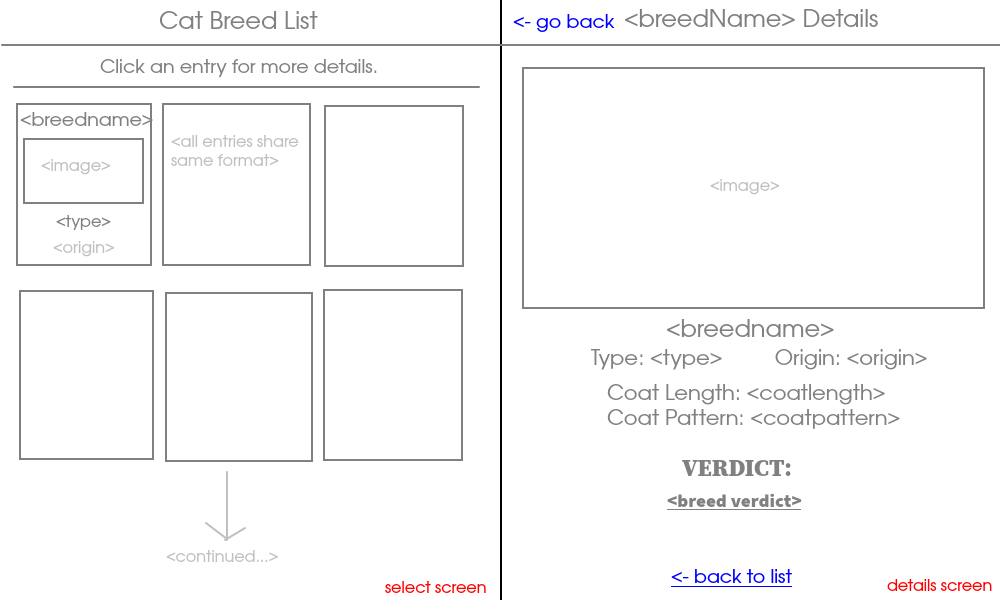

# Cat Opinion Database

Some cat breeds with my frankly unwarranted opinions on them.

"From Scratch" exercise for Alchemy Code Lab

## Wireframe

## Plan
1. database setup and data entry
2. wireframe
3. basic html/css layout for both pages
4. get breed select page working
    - first fetch functions, then render, then display
5. get breed detail page working
    - same substeps as 4

## HTML Elements
#### For select page
- page header with title
- instructions to click on breed for detail
- dynamically generated breed list, display cards for each
    - each card contains breed name, origin, type, image
    - cards are clickable and take user to breed detail page

#### For details page
- page header with title
- link back to select page
- full breed info, image
- big header at bottom with verdict
- link back to list at bottom of page

## State
#### For select page
- `breeds` - array containing list of breeds

## Events
#### For select page
- on page load:
    - fetch breed list from database
    - render
    - display as cards

- on click card:
    - nav to `./details/index.html?id=<id>`
    - details page loads appropriate data based on id in URL

## Functions
### Render
- `renderBreedCard(breed)` - returns div containing breed card for select page
- `renderBreedDetails(breed)` - returns div containing breed details for detail page

### Display
- `displayBreedList()` - display breeds on select page
- `displayBreedDetails(breed)` - displays breed details on detail page

### Fetch
- `fetchBreeds()` - returns array of all breeds with all data from database
- `fetchBreedData(breed)` - returns object for specific breed
